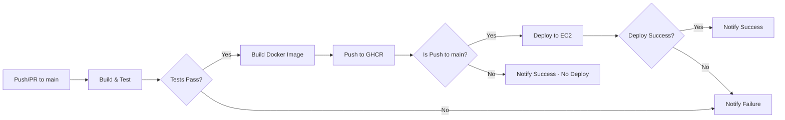

# Botit Task - Flask Application with CI/CD Pipeline

A simple Flask web application demonstrating a complete CI/CD pipeline with automated testing, containerization, deployment to AWS EC2, and monitoring capabilities.

## 📋 Table of Contents

- [Overview](#overview)
- [Application Structure](#application-structure)
- [Technology Stack](#technology-stack)
- [CI/CD Pipeline](#cicd-pipeline)
- [Infrastructure](#infrastructure)
- [Getting Started](#getting-started)
- [Deployment](#deployment)
- [Monitoring](#monitoring)
- [License](#license)

## 🎯 Overview

This project showcases a production-ready Flask application with:

- **Automated CI/CD pipeline** using GitHub Actions
- **Containerized deployment** with Docker
- **Infrastructure as Code** using Terraform
- **AWS EC2 deployment** with automated updates
- **CloudWatch monitoring** and alerting
- **Slack notifications** for pipeline status
- **Kubernetes manifests** for container orchestration (optional)

## 📁 Application Structure

```
Botit_task/
├── src/
│   └── hello.py              # Flask application with endpoints
├── tests/
│   └── test_hello.py         # Unit tests
├── terraform/
│   ├── main.tf               # AWS infrastructure definition
│   ├── provider.tf           # AWS provider configuration
│   ├── variables.tf          # Terraform variables
│   └── output.tf             # Output values
├── kubernetes/
│   ├── deployment.yaml       # Kubernetes deployment manifest
│   └── service.yaml          # Kubernetes service manifest
├── .github/
│   └── workflows/
│       └── ci-cd.yml         # CI/CD pipeline definition
├── Dockerfile                # Container image definition
├── requirements.txt          # Python dependencies
└── docker-compose.yml        # Local development setup
```

## 🛠 Technology Stack

### Application

- **Python 3.12** - Runtime environment
- **Flask 2.2.2** - Web framework
- **pytest 7.2.1** - Testing framework

### Infrastructure

- **Docker** - Containerization
- **GitHub Container Registry (GHCR)** - Container image storage
- **AWS EC2** - Application hosting
- **Terraform** - Infrastructure as Code
- **Kubernetes** - Container orchestration (optional)

### CI/CD

- **GitHub Actions** - Automation platform
- **Slack** - Notification system
- **AWS CloudWatch** - Monitoring and alerting

## 🚀 CI/CD Pipeline

The CI/CD pipeline is defined in [`.github/workflows/ci-cd.yml`](.github/workflows/ci-cd.yml) and consists of three main jobs:

### 1. Build and Test Job

**Triggers:**

- Push to `main` branch
- Pull requests to `main` branch

**Steps:**

1. **Checkout Code** - Retrieves the latest code from the repository
2. **Setup Python 3.12** - Configures the Python environment
3. **Install Dependencies** - Installs packages from `requirements.txt`
4. **Run Tests** - Executes unit tests in `tests/test_hello.py`
5. **Login to GHCR** - Authenticates with GitHub Container Registry
6. **Build Docker Image** - Creates container image with tag `latest`
7. **Push to Registry** - Uploads image to `ghcr.io/<username>/botit_task:latest`

### 2. Deploy Job

**Triggers:**

- Only runs after successful build and test
- Only on push to `main` branch (not on pull requests)

**Steps:**

1. **SSH to EC2 Instance** - Connects to AWS EC2 using stored credentials
2. **Pull Latest Image** - Downloads the newly built Docker image
3. **Stop Old Container** - Gracefully stops the running container
4. **Remove Old Container** - Cleans up the stopped container
5. **Start New Container** - Launches the updated application on port 80

**Required Secrets:**

- `EC2_HOST` - Public IP or hostname of the EC2 instance
- `SSH_PRIVATE_KEY` - SSH private key for authentication

### 3. Notify Job

**Triggers:**

- Always runs after build and deploy jobs complete
- Runs regardless of success or failure

**Steps:**

1. **Determine Status** - Evaluates the overall pipeline result
   - `FAILED` - If any job failed
   - `SUCCESS (No Deploy)` - If tests passed but deployment was skipped (PR)
   - `SUCCESS` - If all jobs completed successfully
2. **Send Slack Notification** - Posts status update with:
   - Status icon (✅ or ❌)
   - Repository name
   - Branch name
   - Commit SHA
   - Link to workflow run

**Required Secrets:**

- `SLACK_WEBHOOK_URL` - Slack incoming webhook URL

### Pipeline Flow Diagram



## 🏗 Infrastructure

### AWS Resources (Terraform)

The infrastructure is defined in [`terraform/main.tf`](terraform/main.tf) and includes:

#### Networking

- **VPC** (`10.0.0.0/16`) - Isolated network environment
- **Public Subnet** (`10.0.1.0/24`) - Subnet with internet access
- **Internet Gateway** - Enables internet connectivity
- **Route Table** - Routes traffic to the internet gateway

#### Compute

- **EC2 Instance** (`t2.micro`) - Hosts the Docker container
  - AMI: Ubuntu 22.04 LTS
  - Automated Docker installation via user data
  - Auto-pulls and runs the application on startup

#### Security

- **Security Group** - Firewall rules:
  - Port 80 (HTTP) - Web traffic
  - Port 5000 (App) - Direct application access
  - Port 22 (SSH) - Remote administration

#### Monitoring

- **CloudWatch Dashboard** - Visual monitoring interface
  - EC2 CPU utilization metrics
  - Service health status
- **CloudWatch Alarm** - Automated alerting
  - Triggers when CPU > 80% for 2 consecutive periods

### Kubernetes Deployment (Optional)

For Kubernetes-based deployments, manifests are provided in the [`kubernetes/`](kubernetes/) directory:

- **Deployment** - Manages application pods
  - 1 replica by default
  - Uses `ghcr.io/sherifemad53/botit_task:latest` image
  - Exposes port 5000
- **Service** - Provides network access
  - Type: ClusterIP (default)
  - External port: 80
  - Target port: 5000

## 🏃 Getting Started

### Prerequisites

- Python 3.12+
- Docker (for containerization)
- AWS Account (for deployment)
- Terraform (for infrastructure provisioning)

### Local Development

1. **Clone the repository:**

   ```bash
   git clone https://github.com/<username>/botit_task.git
   cd botit_task
   ```

2. **Create a virtual environment:**

   ```bash
   python -m venv venv
   source venv/bin/activate  # On Windows: venv\Scripts\activate
   ```

3. **Install dependencies:**

   ```bash
   pip install -r requirements.txt
   ```

4. **Run the application:**

   ```bash
   python src/hello.py
   ```

5. **Access the application:**
   - Main page: http://localhost:5000
   - Health check: http://localhost:5000/health

### Running Tests

```bash
python tests/test_hello.py
```

Or using pytest:

```bash
pytest tests/
```

### Docker Development

1. **Build the image:**

   ```bash
   docker build -t botit-task .
   ```

2. **Run the container:**

   ```bash
   docker run -d -p 5000:5000 botit-task
   ```

3. **Using Docker Compose:**
   ```bash
   docker-compose up
   ```

## 📦 Deployment

### Setting Up Infrastructure

1. **Configure AWS credentials:**

   ```bash
   export AWS_ACCESS_KEY_ID="your-access-key"
   export AWS_SECRET_ACCESS_KEY="your-secret-key"
   ```

2. **Initialize Terraform:**

   ```bash
   cd terraform
   terraform init
   ```

3. **Review the plan:**

   ```bash
   terraform plan
   ```

4. **Apply the infrastructure:**

   ```bash
   terraform apply
   ```

5. **Note the EC2 public IP from outputs:**
   ```bash
   terraform output
   ```

### Configuring GitHub Secrets

Add the following secrets to your GitHub repository (Settings → Secrets and variables → Actions):

1. **EC2_HOST** - Your EC2 instance public IP
2. **SSH_PRIVATE_KEY** - Private key for SSH access (corresponding to `botit-key` in AWS)
3. **SLACK_WEBHOOK_URL** - Slack webhook URL for notifications

### Manual Deployment

To manually deploy to EC2:

```bash
# SSH into the instance
ssh -i botit-key.pem ubuntu@<EC2_IP>

# Pull the latest image
docker pull ghcr.io/<username>/botit_task:latest

# Stop and remove old container
docker stop botit_task
docker rm botit_task

# Run new container
docker run -d --name botit_task -p 80:5000 ghcr.io/<username>/botit_task:latest
```

### Kubernetes Deployment

```bash
# Apply the manifests
kubectl apply -f kubernetes/deployment.yaml
kubectl apply -f kubernetes/service.yaml

# Check the deployment
kubectl get deployments
kubectl get pods
kubectl get services

# Access the application (if using LoadBalancer)
kubectl get service botit-task
```

## 📊 Monitoring

### CloudWatch Dashboard

Access the CloudWatch dashboard in the AWS Console:

1. Navigate to CloudWatch → Dashboards
2. Select "Botit-Dashboard"
3. View CPU utilization and service status

### CloudWatch Alarms

The `cpu-high-utilization` alarm will trigger when:

- CPU usage exceeds 80%
- Condition persists for 2 consecutive evaluation periods (4 minutes)

### Application Health Check

The application provides a health endpoint:

```bash
curl http://<EC2_IP>/health
```

Expected response: `OK`

### Logs

**View Docker logs on EC2:**

```bash
ssh -i botit-key.pem ubuntu@<EC2_IP>
docker logs botit_task
```

**View CloudWatch logs:**

- Navigate to CloudWatch → Log groups
- Select the appropriate log group for your EC2 instance

## 🔧 Application Endpoints

| Endpoint  | Method | Description     | Response                    |
| --------- | ------ | --------------- | --------------------------- |
| `/`       | GET    | Main page       | `Hello, Botit!`             |
| `/health` | GET    | Health check    | `OK`                        |
| `/<page>` | GET    | Catch-all route | `404 - Page does not exist` |

## 📄 License

This project is licensed under the MIT License - see the [LICENSE](LICENSE) file for details.

## 📞 Support

For issues, questions, or contributions, please open an issue in the GitHub repository.

---

**Built with ❤️ for Botit**
